# checkpoint 0

# checkpoint 1

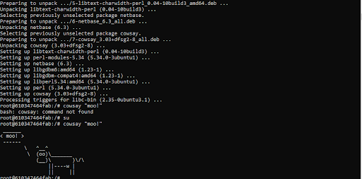

# checkpoint 2
#### creation of db and rocketchat containers using mongo and rocketchat images,
#### and listing of all running containers as well as all images

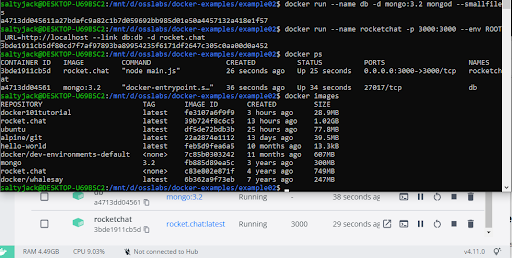 

# checkpoint 3
#### running hello py on localhost server

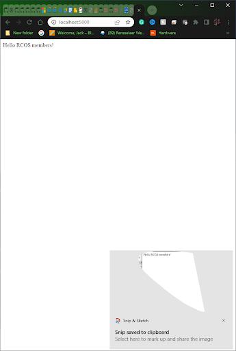 

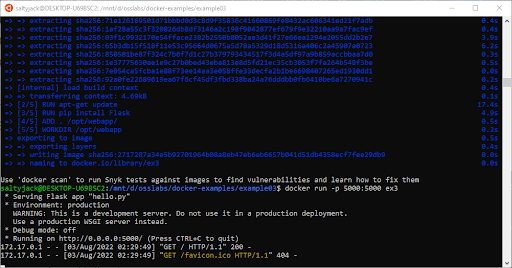

# checkpoint 4
#### failed docker build 

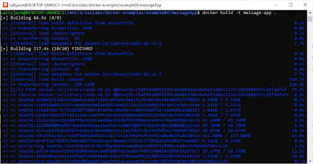

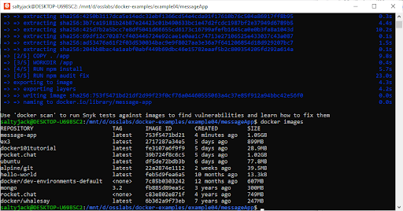

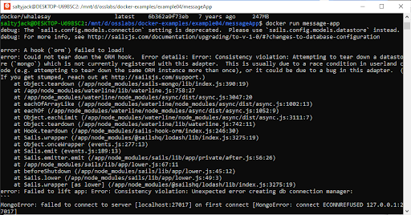

#### building with the compose file

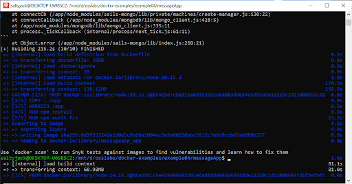

#### running docker-compose up
  
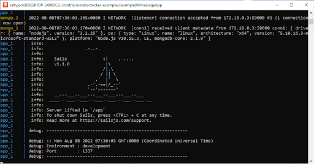

#### generation and getting list of messages
  
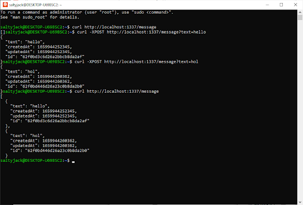

#### modifying a message
  
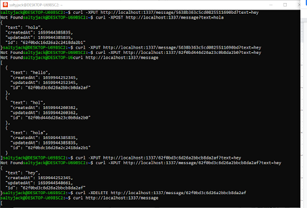

#### deleting a message

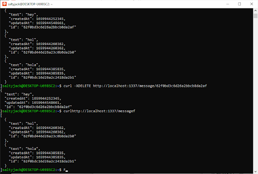